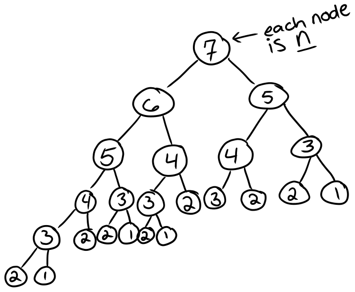
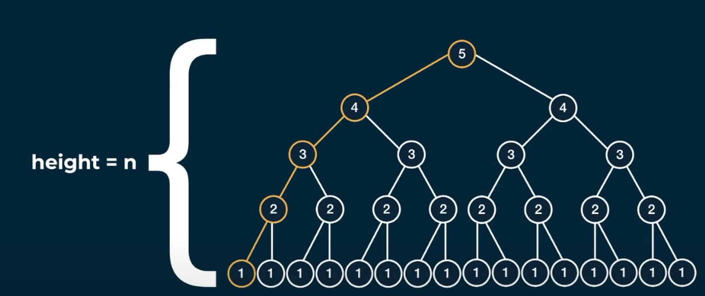
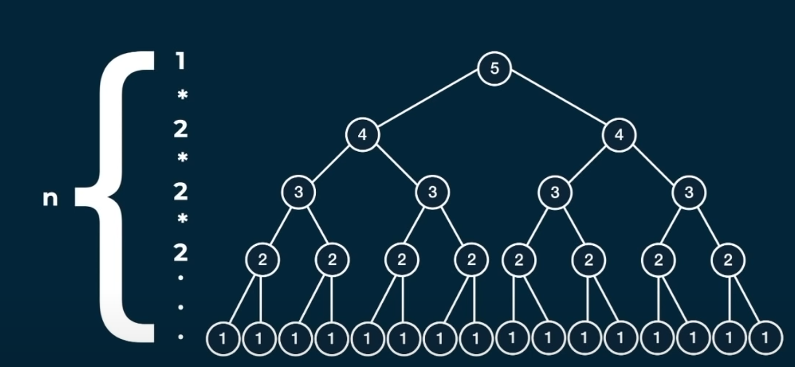
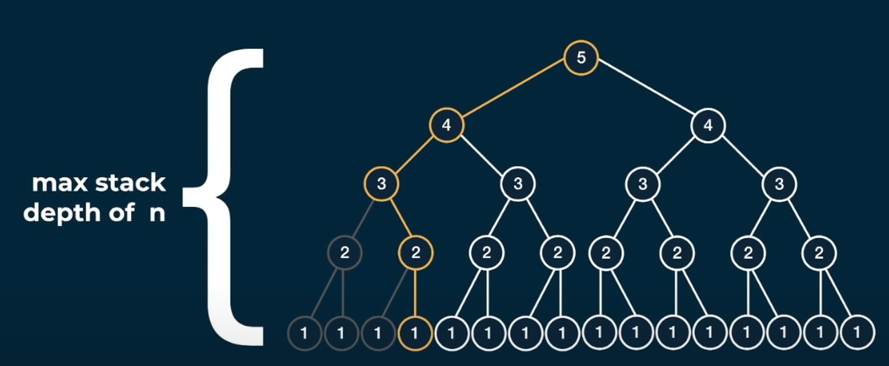
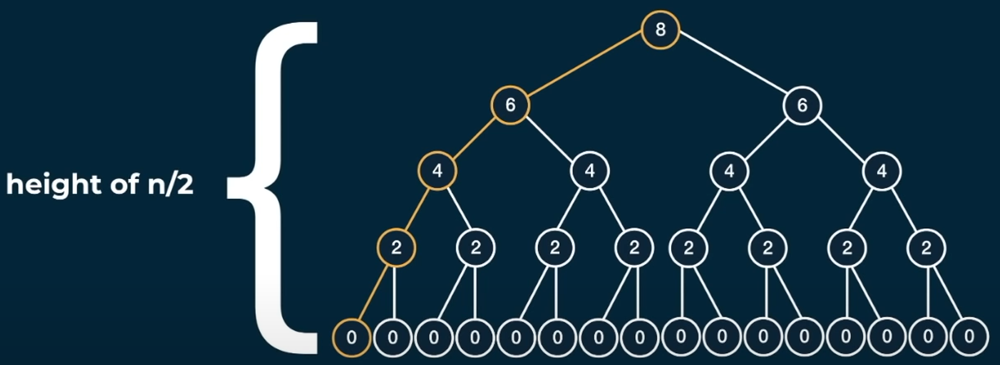

# Fibonacci Memo
Resources:
- [fib-memo vid](https://youtu.be/oBt53YbR9Kk?list=PLD8pC1MXKesXC9BIVO5WucyjfKTTaRwMd&t=220)

## Question:
Write a function `fib(n)` that takes in a number as an argument. The fucntion should return the n-th number of the fibonacci sequence.

### How Fib works:
	The 1st and 2nd number of the sequence is 1. To generate the next number of the fibonacci sequence, we sum the previouis two numbers.

*n is the position*
```
n:      1, 2, 3, 4, 5, 6,  7,  8,  9, ..
fib(n): 1, 1, 2, 3, 5, 8, 13, 21, 34, ..
```

```javascript
// *not for large numbers*
// recursive method:
const fib = (n) => {
    if (n <= 2) return 1;
    return fib(n - 1) + fib(n - 2);
}
console.log(fib(6)); // 8
console.log(fib(7)); // 13
console.log(fib(8)); // 21
```



---  

> height*(n)* is just the distance from the root node;
> from the root*(5)* node to the leaf*(1)* node is the height of the tree.

---
O(2^n)time

> at each level we can assume that each node will have 2 children.
> so each level of the tree will double the height.

O(n)space

> the amount of stack frames we will use is the height of the tree.

---
O(2^n)time

> from level to the next we double the amount of nodes;
> based on our last problem we can see that our space would be O(n)

---
memoization
```javascript
 const fibo = (n, memo = {}) => {
    if (n in memo) return memo[n];
    if (n <= 2) return 1;
    return fibo(n - 1) + fibo(n - 2);
};
```
> memo will be *js object*
	> *keys* will be an *arg* to the *function*
	> *values* will be returned