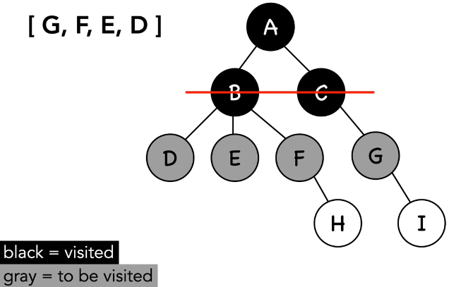

breadth first search (bfs)
---
> algorithm for searching a graph; algorithm proceeds horizontally before proceeding vertically; root node -> adjacent nodes

- *breadth*: broad or wide
- *queue*: to keep track of values
- *vertices/vertex*: point where two edges meet
- *edge/s*: connection of two vertices

time complexity:
---
`o(v + e)`: vertices and edges