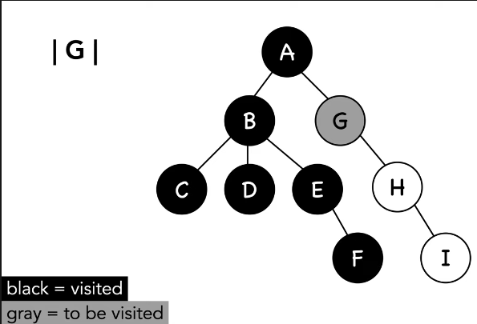

depth first search (dfs)
---
> algorithm for searching a graph; algorithm proceeds vertically before proceeding horizontally

- *stack*: to keep track of values
- *vertices/vertex*: point where two edges meet
- *edge/s*: connection of two vertices



time complexity
---  
`o(v + e)`: vertices and edges

example:
---   
```javascript
dfs(goal, v = this.vertices[0], discovered = []) {
    let adj = this.adjacent;
    discovered[v] = true;
    for (let i = 0; i < adj[v].length; i++){
        let w = adj[v][i];
        if (!discovered[w]) {
            this.dfs(goal, w, discovered);
        }
    }
    return discovered[goal] || false;
}
```
code explanation:
- add first `node` to discovered
- loop through `adjacent` `vertices`
    - check if `w` isn't already discovered
        - make *recursive* function call, giving it `w` & discovered nodes
- return if `goal` is in discovered otherwise return `false`

---
### take-aways
`dfs` goal:
> given a graph, starting vertex, goal, start at the root and search path by path

`dfs` definition:
> an algorithm that searches a graph for a specific goal by checking all of the vertices connected on a path before moving on to check the adjacent vertices.

`dfs` vs `bfs`:
> bfs checks all of the vertices adjacent to a given vertex before checking the vertices adjacent to those vertices. while dfs checks all vertices on a path and then backtracks.

`dfs` use cases:
- finding the bridges in a *graph*
- finding solution to a maze
- defining the topology of a *graph*